Proyecto final Analytics

# *Proyecto :*

"Optimización Operativa y Estrategia de Expansión Autofinanciada: Del diagnóstico y gestión de stock a la redistribución inteligente de activos en Amazon.".

# *Scope del Proyecto (Scope)*

El proyecto ha cubierto con éxito los siguientes ejes analíticos :

🟣 ***Validación de Elasticidad Operativa:*** Se ha confirmado la correlación entre la ruptura de stock (Stockouts) y las tasas de cancelación logística. Se ha demostrado empíricamente que la falta de inventario disponible impacta directamente en la experiencia del cliente y la reputación del vendedor.

🟣 ***Gobernanza de Datos (SKUs Huérfanos):*** Se ha realizado una auditoría exhaustiva del 5.97% de los productos que registran ventas pero no existen en el inventario maestro. Hemos categorizado su impacto comercial y establecido su peso relativo dentro del volumen total de ventas, aunque su trazabilidad origen-logística quedó fuera del alcance técnico.

🟣 ***Optimización Estratégica (Modelo IIC):*** Se ha desarrollado e implementado el Índice de Inmovilización Crítica (IIC). Este modelo permite identificar qué artículos están acaparando espacio físico y capital de trabajo sin rotación comercial, priorizando los activos que requieren una intervención logística inmediata.

🟣 ***Plan de Acción Geográfico:*** Se ha diseñado una matriz de redistribución de inventario inmovilizado hacia "Océanos Azules" (estados con alta demografía y baja penetración), proporcionando una hoja de ruta accionable para la expansión autofinanciada.

# *Limitaciones y Aspectos no incluidos (Out of Scope)*

Para mantener la integridad y la viabilidad del análisis con los  datos disponibles, el proyecto excluye los siguientes puntos:

🟣 ***Trazabilidad causa-raíz de SKUs huérfanos:*** Si bien se ha identificado el impacto comercial de estos productos "fantasma", no se ha realizado una investigación forense para determinar el origen logístico o administrativo de su creación en el sistema. Se considera un área de mejora en la higiene de datos interna.

🟣 ***Modelado predictivo de perfiles de cliente:*** El análisis se ha centrado en la eficiencia del activo (inventario) frente a la geografía. La creación de perfiles conductuales (clustering/machine learning) para presentar promociones personalizadas se ha excluido para priorizar la estrategia de optimización logística, la cual ofrece un retorno de inversión (ROI) más inmediato.

🟣 ***Análisis morfológico poblacional:*** Aunque se ha detectado una baja rotación en ciertas tallas, el análisis no profundiza en si esta tendencia se debe a factores morfológicos locales o culturales, limitándose a señalar la ausencia de datos históricos de venta como una oportunidad para el testeo comercial controlado.


# *Clasificación de Datos(Estrategia de Auditoría)*

   El análisis ha seguido una estrategia de segmentación lógica para asegurar la integridad de los resultados, clasificando el universo de datos en tres capas de validez:

   **Universo de Datos Limpios (128.975 registros):**
   Es el volumen total extraído de la fuente, incluyendo la totalidad de registros transaccionales sin filtrar.
   
   - Objetivo: Evaluar volumen logístico. 

   **Dataset Financiero / Limpio  (121.180 registros):**
   Corresponde al "Core Financiero". Este subconjunto incluye únicamente los registros con Amount validado (incluyendo ventas a valor 0). Sobre este dataset se han ejecutado los cálculos de Pareto, rentabilidad, KPIs operativos y análisis geográfico.

   - Objetivo: Eliminar el ruido financiero para obtener métricas de negocio precisas.

   **Discrepancia (7.795 registros):**
   Comprende todas las líneas donde Amount es NaN. Este grupo actúa como nuestra "Capa de Auditoría", permitiéndonos identificar fallos sistémicos en lugar de sesgar las métricas de negocio. Dentro de este grupo, hemos aislado:

   - Subconjunto "SKUs Fantasma" (456 registros): Donde además de no tener Amount, la bandera Es_Fantasma es True. Estos registros representan errores críticos de sincronización entre el catálogo de Amazon y el inventario maestro.

# *Informe Ejecutivo: Optimización Operativa y Expansión Estratégica*

Este proyecto presenta un Análisis Exploratorio de Datos (EDA) integral sobre la operativa logística y comercial de un vendedor en Amazon India para un catálogo de productos.  

Consolida la información de un catálogo masivo (con más de 128,000 transacciones en un marco temporal específico) para identificar deficiencias operativas y profundizar en alternativas de expansión comercial.
El análisis parte de una hoja en blanco y evoluciona desde la limpieza de datos hasta las recomendaciones para aprovehcar ventajas competitivas.

Tras el análisis, se consideran estos los puntos más destacables para la mejora o revisión interna de proceso:

   **1. El análisis comprobó la relación directa entre las incidencias/cancelaciones, y  el impacto del método de despacho.**

   * Carga Transaccional: Se detectó que el 69.5% de los pedidos son gestionados por la logística de Amazon (FBA), mientras que el 30.5% restante es despachado por el propio vendedor (Merchant).

   * Rendimiento y Riesgo: El modelo logístico del vendedor (Merchant) presenta una tasa de incidencias y cancelaciones del 22.9%, cifra significativamente mayor al 12.8% de los envíos gestionados por Amazon.  
   Una prueba de Chi-cuadrado confirmó estadísticamente que el canal de despacho influye fuertemente en el éxito del pedido. La falta de inventario o las deficiencias del método Merchant golpean directamente la experiencia de cliente y generan pérdidas.

<div style="margin-left: 30em;">

| Fulfilment | Expedited | Standard |
| :--- | :---: | :---: |
| **Amazon** | 98.8% | 1.2% |
| **Merchant** | 0.0% | 100.0% |
| *Ship Service Level* | | |
</div>

a
   <p align="center">
  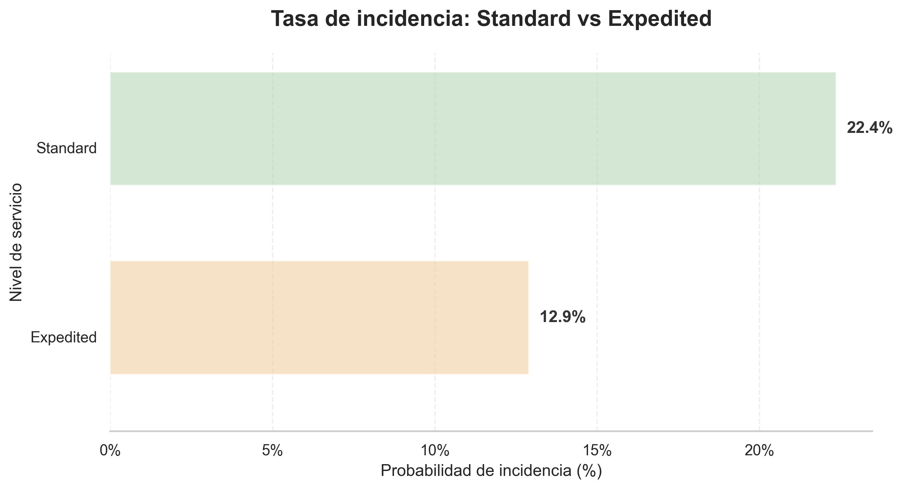
</p>
  

   **2. Gobernanza y Calidad de Datos (SKUs Huérfanos)**  

   Para garantizar métricas precisas, se aplicó un filtro estricto sobre el ecosistema de datos, limpiando "valores centinela" (ej. fechas inválidas como 9999 o 1900) y nulos encubiertos.

   * El Gap de Gestión: Tras cruzar el histórico de ventas con el inventario maestro, se logró una tasa de coincidencia (Match Rate) del 94.03%. Sin embargo, se descubrió que el 5.97% del volumen de ventas (7,706 transacciones, correspondientes a 578 SKUs) son SKUs 'fantasma'.

   * Impacto: Son productos "fantasma" que registran ingresos y se comercializan con éxito, pero que no existen administrativamente en la base de datos de inventario maestro. Esta anomalía requiere urgente corrección en la higiene de datos interna, aunque su causa raíz haya quedado fuera del alcance de este proyecto. 

   **3. Optimización Estratégica (Matriz de Rotación e IIC)**  

   El proyecto implementó una matriz logística cruzando los Ingresos Totales con el Volumen de Stock, aplicando una escala logarítmica para revelar el verdadero comportamiento de la demanda (aislando el ruido por colas largas).

   <p align="center">
  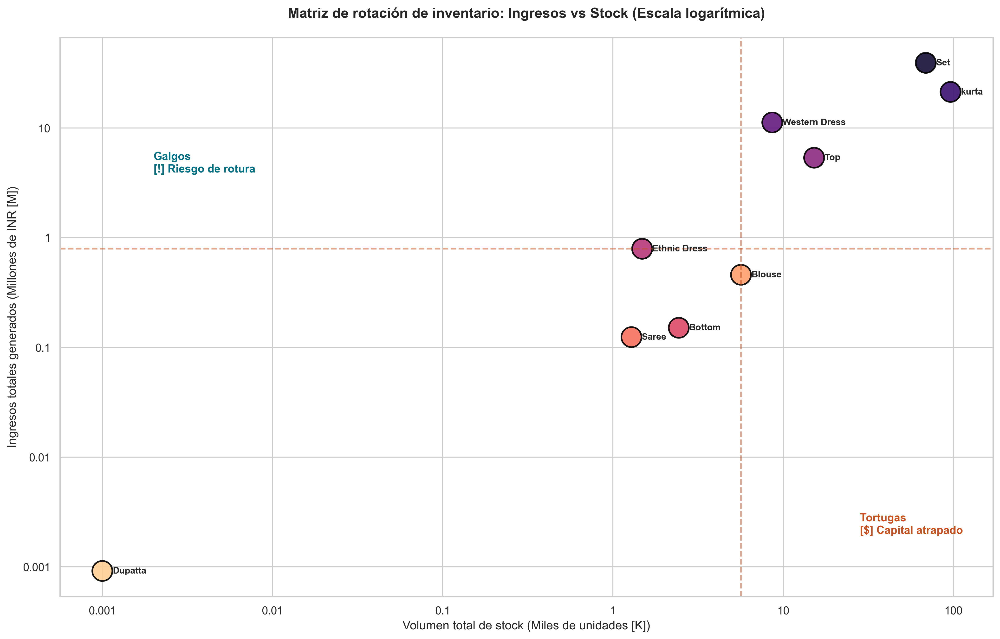
</p>
   
   Se determinó el ciclo de vida del catálogo mediante la métrica DSI (Días de Cobertura de Inventario), clasificando el portafolio en cuatro cuadrantes:
   
   Análisis de la vida útil del inventario comparado con la meta de 30 días.

<p align="center">
  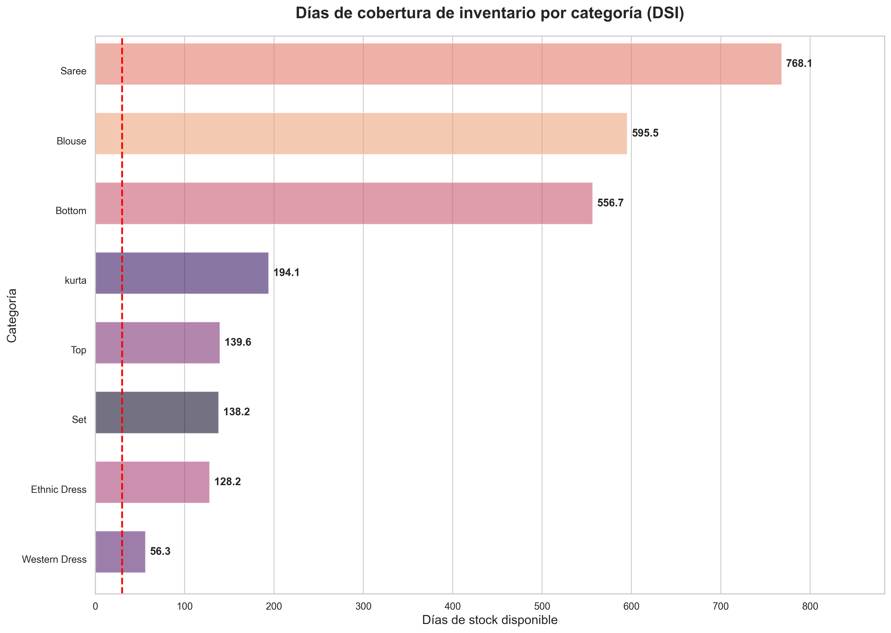
</p>
   
   Se presentan estos principales highlights:
   
   1. ***Eficiencia de Capital:*** Existen categorías ***"Tortuga"***(ej. ***Blouse***) que inmovilizan capital al tener inventarios superiores a la mediana pero con bajo retorno de ingresos. Requieren políticas de liquidación o revisión de pronóstico de demanda. Por otro lado, categorías ***"Dormidas"*** como ***Saree*** muestran baja tracción comercial general.
   2. ***Estabilidad de Demanda:*** La secuencialidad temporal valida que el flujo de venta es estable a nivel diario. No existen sesgos de "días sin datos" que invaliden los cálculos de DSI.
   3. ***Riesgo de Rotura (Stock-out) vs Flujo de Caja:*** Las categorías catalogadas como ***"Estrellas"*** (ej. ***Set, Kurta***) sostienen el núcleo del negocio. Aunque mantienen altos niveles de stock, su DSI ajustado exige un monitoreo logístico constante. Adicionalmente, el segmento ***"Galgo"*** (ej. ***Ethnic Dress***) demuestra una alta rotación comercial que debe ser protegida con reposiciones ágiles para no perder ventas.

   4. Plan de Acción Geográfico (Expansión Autofinanciada)
   Con base en los activos estáticos detectados en el cuadrante de Tortugas y Dormidos, el proyecto diseña una matriz de redistribución estratégica. El objetivo es desviar estos artículos sin rotación hacia "Océanos Azules" geográficos: estados o ciudades con alta densidad poblacional pero baja penetración histórica. Esto transforma un pasivo logístico en una herramienta de expansión autofinanciada, liberando flujo de caja sin necesidad de modelado predictivo o de machine learning complejo.

<br>
<br>

**Conclusión Operativa:**
   El alcance del presente análisis permite fundamentar las próximas decisiones de gestión de inventario y expansión. 
   Los datos nos indican que la clave del crecimiento  debe enfocarse en la mejora de la distribución y atención de pedidos y en la **redistribución inteligente del activo existente** hacia los mercados con mayor potencial de adopción.
   Según los indices de penetrción de mercado, es recomendable replantear los esfuerzos para ofrecer alternativas atractivas para aquellas zonas que pese a representar un volumen alto en las ventas, el promedio de envios con dichos destinos es mucho más bajo que el de otras zonas con poblaciones más reducidas.
<br>
<br>
<br>

# *Instalaciones:* 

🔴 Revisamos el entorno y creamos la conexión a la base de datos con archivo .env  que contiene las credenciales.

## ATENCION: Para replicar: 🚧 se debe crear archivo .env con la información en la raiz de proyecto ##

con la siguiente información:

   ### Configuración segura para la base de datos local de PostgreSQL
      DB_HOST=localhost
      DB_PORT=5432
      DB_NAME=ecom_analytics
      DB_USER=postgres
      DB_PASS=tupassword

***1. Entorno de ejecución***

Se recomienda utilizar un entorno virtual (vEnv o Conda) para evitar conflictos de versiones.

+ Python: Versión 3.9 o superior.

+ Gestor de paquetes: pip.

***2. Requisitos e Instalación***

### 🛠️ Tecnologías y Librerías Clave

* **🧱 Core & Datos:** `Pandas 3.0` & `NumPy 2.4` — Limpieza, manipulación de dataframes y cálculo numérico de alta eficiencia.
* **📦 Almacenamiento Columnar:** `PyArrow` & `FastParquet` — Compresión y lectura ultrarrápida de datos procesados (esencial para la conexión con Power BI).
* **🎨 Visualización:** `Seaborn` & `Matplotlib` — Generación de gráficos estadísticos, tendencias de ventas y mapas de calor para el EDA.
* **🗄️ Base de Datos:** `SQLAlchemy` & `Psycopg2` — Conexión e Ingesta automatizada de los datasets limpios hacia PostgreSQL.
* **🔐 Seguridad:** `Python-Dotenv` — Gestión segura de credenciales locales mediante variables de entorno (`.env`).
* **📓 Entorno:** `JupyterLab` & `IPyKernel` — Espacio de trabajo interactivo para el desarrollo y ejecución de los notebooks analíticos.


Para replicar este entorno de análisis y asegurar el correcto funcionamiento de los scripts y notebooks, asegúrate de tener instalado Python 3.10+ y ejecuta el siguiente comando en tu terminal con tu entorno virtual activo:

```bash
pip install -r requirements.txt
```
Dependencias principales

Puedes instalarlas ejecutando:

      Bash
      pip install pandas pyarrow jinja2

## *⚠️ Atención: Pasos previos a la ejecución*

Para asegurar que los cuadernos funcionen correctamente, realiza estas acciones antes de abrir los libros de Jupyter:

**Creación del entorno:** Crea y activa tu entorno virtual en la raíz del proyecto:

      'Bash
      python -m venv venv'
      # En Windows:
      .\venv\Scripts\activate

**Instalación de dependencias:** Ejecuta pip install -r requirements.txt.

**Organización de Datos:** Asegúrate de que los archivos de datos brutos estén en la carpeta ../data/raw.  

No cambies la estructura de carpetas.

**Kernel de Jupyter:** Asegúrate de seleccionar el Kernel asociado a tu entorno virtual (venv).

## *Orden de ejecución:*

### Primero: Ejecuta eda_amazon_preprocessing.ipynb (Limpieza y transformación).

### Segundo: Ejecuta eda_amazon_final.ipynb (Análisis y visualización).


## 📂 Estructura del Proyecto

```text
JC_EDA_ProyectoFinal
├── .env                                       #credenciales para conectarse a postgres  
├── .venv
├── .gitignore
├── innitial_project_conf
├── README.md
├──requirements.txt
├── proyecto-final-analytics/
    ├── dashboard/
    │   ├── df_amazonstock_clean_fordashboard.parquet
    │   └── eda_amazon_in_final_3m.pbix
    ├── data/
    │   ├── processed/
    │   │   ├── df_amazonstock_clean.csv
    │   │   ├── df_amazonstock_clean.parquet
    │   │   ├── df_amazonstock_clean_audit.csv        #db para PowerBi
    │   │   └── df_amazonstock_clean_audit.parquet    #db para PowerBi, con flags de incidencias y fantasmas
    │   └── raw/
    │       ├── Amazon Sale Report.csv
    │       ├── df_initial_amazon_stock_RAW.csv       #db creada con join de ambas
    │       ├── df_initial_amazon_stock_RAW.parquet
    │       ├── india_states_population_raw.csv       #data externa utilizada para el análisis
    │       └── Sale Report.csv
    ├── notebooks/
    │   ├── eda_amazon_final.ipynb                    #Cuaderno jupyter con EDA
    │   └── eda_amazon_preprocessing.ipynb            #cuaderno jupyter con carga y limpieza
    │   └─
    └── reports/
        ├── auditoria_calidad_datos.csv               #resumen de columnas y datos iniciales
        ├── estados_a_corregir.csv                    #Estados de la india que requeria atención manual
        ├── metadatos_tiempo.txt                      #nota de horizonte temporal de la data
        ├──reporte_geografico_ventas_pareto_completo.xlsx  #informe geográfico de pareto 
        │ 
        └──figuras                                    #Imágenes de plots y otras del proyecto
```

💡 Nota sobre Power BI y Parquet: Si vas a consumir los archivos .parquet procesados en Power BI de forma local, recuerda que el programa suele requerir la instalación del Java Development Kit (JDK) y la configuración de la variable de entorno JAVA_HOME para poder interpretar correctamente este formato de manera local.

# *Flujo del Pipeline de Datos*

   1. Análisis Exploratorio (EDA): Identificación de valores nulos, registros duplicados y tipos de datos inconsistentes en los reportes RAW de Amazon.

   2. Transformación y Optimización: Los archivos de texto plano .csv (algunos superando los 120 MB) son procesados y guardados en formato .parquet, reduciendo su peso físico en más de un 70% sin pérdida de información para agilizar su lectura.

   3. Persistencia en Base de Datos: A través de una conexión segura manejada por variables de entorno, los datos limpios se inyectan directamente en tablas relacionales dentro de PostgreSQL.

   4. Visualización en Power BI: Conexión directa a la base de datos y a los archivos Parquet para el diseño de dashboards interactivos con KPIs de ventas, rendimiento de stock y tendencias temporales.

# *Desarrollo del proyecto*

## 📊 1. Diagnóstico Inicial y Auditoría de Calidad de Datos

Para garantizar que los KPIs operativos no se vieran sesgados, diseñamos  un escáner de calidad de datos. 
Este escáner no solo busca nulos tradicionales (NaN), sino que audita 'Valores Centinela' o fechas dummy históricas como 1900 o 9999.  
Identificar estos elementos de forma temprana impedirá que las desviaciones temporales alteraran el cálculo real de los valores en el análisis.

<p align="center">
  


**🕵️‍♂️ Hallazgos ---**
1. Variable 'Date': Detectada como tipo 'str'.
   ⚠️ PROBLEMA: Es un string. No podemos hacer filtros temporales ni series continuas.

2. Muestra de la Llave Primaria 'SKU' en bruto:
['SET389-KR-NP-S', 'JNE3781-KR-XXXL', 'JNE3371-KR-XL']
   ⚠️ RIESGO: Al provenir de archivos CSV independientes, los strings pueden contener espacios invisibles 
   a los lados (ej. 'SKU-01 ' vs 'SKU-01'), lo que causaría que el JOIN ignore registros válidos.

3. Análisis de repetición de textos en columnas cualitativas:
   - Valores únicos en 'Status': 13
   - Valores únicos en 'Fulfilment': 2
   ⚠️ OPTIMIZACIÓN: Al tener tan pocos valores únicos repartidos en 128.000 filas,
   guardarlos como texto estándar ('object') consume memoria RAM y tambien no permite
   futuro análisis de correlación como 'categoria' y 'estado pedido' .


## 2. Acciones Pre-Join

**2.A Limpieza basica pre-JOIN**

* Limpiamos la Join Key (SKU): Quitamos espacios invisibles a los lados de los códigos de producto en ambos DataFrames para asegurar un cruce del 100% libre de fallos de caracteres.

* Conversión Temporal: Pasamos la columna de fechas a tipo datetime64[ns] para poder explotar series temporales más adelante.

* Validez para analisis estadístico y Eficiencia en RAM: Transformamos las columnas con textos repetitivos en tipo category, reduciendo el peso del DataFrame, pero principalmente
se convierten las columnas en categorias  para poder cruzar las fechas, aplicar el test estadístico de Chi-cuadrado a las categorías logísticas y asegurar que las correlaciones del modelo final reflejen la realidad operativa de la empresa.
Columnas : ['Status', 'Fulfilment', 'Category', 'Size', 'ship-state']


**2.B Validación de Intersección entre Dataframes**

Como control de los de datos, antes de la unión de los datasets, se irealizó un análisis analítico de intersección de conjuntos  sobre las llaves primarias `SKU`. 
Esta prueba preventiva mide la tasa de cobertura (*Match Rate*) para evitar fallos en etapas posteriores.

Se valida qué porcentaje de las transacciones de venta intersectan con el catálogo maestro, identificando la existencia de SKUs huérfanos y garantizando la predictibilidad matemática.

* 🔍 --- Auditoría de Intersección (PRE-JOIN) ---
* 📦 SKUs únicos en el histórico de Ventas (Amazon): 7,195
* 📖 SKUs únicos en el Catálogo Maestro: 9,171
* 🤝 SKUs idénticos encontrados en AMBAS fuentes (Intersección): 6,617
* ⚠️  SKUs huérfanos (Existen en ventas pero NO están en el catálogo): 578
* 
* 📈 COBERTURA OPERATIVA DEL PIPELINE:
* 🧮 121,269 de 128,975 transacciones encontra* rán su precio base.

🎯 Tasa de Coincidencia (Match Rate): 94.03%

Datos Seguros (94.03%): De las 128,975 ventas totales, 121,269 filas van a encontrar su stock de catálogo de forma  inmediata.  

El "Gap" de Gestión (5.97%): Hay exactamente 7,706 filas de ventas ($128,975 - 121,269$) asociadas a esos 578 SKUs huérfanos.

Estos productos se vendieron en Amazon pero no están dados de alta en el catálogo maestro.


**2.C Análisis, Diagnóstico y limpieza de Registros Duplicados en el Catálogo Maestro**

Antes de proceder con la consolidación de las dos fuentes de  datos, se detectó una discrepancia de 100 registros en `df_catalogo` (9,271 filas totales frente a 9,171 valores únicos de SKU).  

Para determinar la naturaleza de esta duplicidad y evitar pérdidas de información en el proceso de integración, se aisló el conjunto afectado y se analizo (`unique`).  

Se analizaron las filas duplicadas encontrando:
* 9171 únicos ( incluidos Nan y #REF! )
* 100 registros de diferencia
    
* 106 registros incluidos en la lista deplicados
* 6 Valores únicos en los 106 valores duplicados ( incluidos Nan y #REF!)
* 15 registros con '#REF'
* 83 registros con Nan

 Son 4 SKUs legítimos duplicados (que se repiten solo 2 veces cada uno). Al revisar tu muestra visual previa (con el caso del PJNE3404-KR-4XL), descubrimos que la duplicidad ocurre porque una fila tiene el color Mauve con stock y la otra el color Wine con stock 0.
 
***Limpieza: Reglas aplicadas para la eliminación de duplicados del catálogo y resultado:*** 

- Se excluyen los registros sin clave indexable (NaN, #REF!).  
- Se consolidan los duplicados con valores 'SKu' válidos realizando una agrupación con método groupby().agg(),sumando el 'Stock' para reducir la pérdida de existencias.  
- Finalmente, se restaura la secuencia de origen mediante el ordenamiento del 'index' inicial.
- Obtenemos un dataset 'df_catalogo_clean' de Dimensiones finales (9169, 7).


## 3. Join df_amazon & df_catalogo y Validación requisitos del proyecto. 

Se opta por un LEFT JOIN con :  
df_amazon: 128975 | Columnas: 24
df_catalogo_clean: 9169 | Columnas: 2 de 7 ( SKU, STOCK)

🎯 --- AUDITORÍA DE REQUISITOS MÍNIMOS ---
Volumen de transacciones logradas (Filas): 128,975 (Exigido: >50,000)
Extensión del modelo unificado (Columnas): 26 (Exigido: >20)

Creamos un fichero con esta data como backup:
- CSV RAW exportado exitosamente en: RAW/df_initial_amazon_stock_RAW.csv
- Archivo Parquet RAW exportado exitosamente en: RAW/df_initial_amazon_stock_RAW.parquet

## 4.Limpieza 

***A. Análisis y resumen de anomalías a limpiar.***  
🧹 **Reglas aplicadas para la limpieza estructural y resolución de dominios:**

- *Refutación de la Hipótesis A:* (Courier Status vs Amount):
Solo el 25.3% de los pedidos sin estado de mensajería están cancelados/sin importe.  
Esto significa que el 75% de los pedidos sin Courier Status SÍ tienen Amount (el cliente pagó).

   => Para conservar la fidelidad contable, imputamos los nulos logísticos con el valor Centinela `Unknown`.

- *Confirmación de hipótesis B :* Hay una correlación del 100%: cuando el vendedor despacha el pedido (Merchant), la columna fulfilled-by , marca 'Easy Ship'. Cuando lo despacha Amazon, la columna simplemente se queda vacía.  

   => Se valida la dependencia funcional de la columna `fulfilled-by`, imputando el 69.55% de sus valores nulos con la etiqueta `Amazon`, correlacionado estrictamente con la red de distribución propia.


- Se normalizan las ausencias en variables de marketing (`promotion-ids`) asumiendo transacciones sin descuento aplicado (`No Promotion`).

- Se mantiene la integridad de los registros financieros imputando métricas geográficas residuales nulas (0.03%) bajo la constante `UNKNOWN`.

- Se elimina el atributo `Unnamed: 22` considerado un  resido del proceso de conversión del `.csv`.

B. Limpieza por bloques

* Arquitectura del Proceso de Limpieza (El "Por Qué" y los Bloques):  
Para mantener la consistencia de los datos y la lógica del negocio, dividimos el pipeline de limpieza en estos 4 Bloques   
(Nota: Previo a la limpieza de datos, se implementó una política de trazabilidad a nivel de columna, clonando los atributos objetivo con el sufijo _raw para cualquier auditoría de los valores originalmente nulos).

* Bloque 1: Financiero y Transaccional

   Columnas: Amount, currency, promotion-ids, B2B.

   Estrategia Real: Mantener el la información contable y normalizar variables de negocio.  
    Se mantienen las transacciones con Nan (Amount)- 7795 registros de los cuales 7566 llevan status 'Cancelado' con mismo valor para mantener integridad para calculos posteriores. Se asigna la divisa base del mercado (INR) a las ausencias en currency. Las ventas sin cupón se catalogan explícitamente como No Promotion.

* Bloque 2: Operacional y Logístico

   Columnas: Status, Courier Status, Fulfilment, fulfilled-by, ship-service-level, Qty.

   Estrategia Real: Resolver relaciones de datos validadas en la práctica.  
   Se asigna Amazon en la columna fulfilled-by al confirmar que el despacho fue gestionado por ellos, y se coloca el valor de control Unknown en Courier Status. Así evitamos alterar el volumen total de ventas válidas que simplemente no tienen actualización de mensajería.

* Bloque 3: Geográfico y de Distribución.  

   Columnas: ship-city, ship-state, ship-postal-code, ship-country.

   Estrategia Real: Debido al alto número de valores únicos (alta cardinalidad) en estas variables, se decidió regresar estas columnas a formato de texto plano (str) para evitar saturar la memoria de Pandas.

   Los valores nulos se completaron con la etiqueta UNKNOWN; de esta manera, preservamos los ingresos asociados a esas filas sin alterar ni inventar ubicaciones falsas

   Al tener una lista extensa de ciudades, estados, se apuesta por una limpieza en detalle de la columna ship-state teneindo en cuenta que existen 69 registros originales, ubicando los estados en un listado para su posterior normalización y reemplazo con solo 49 únicos finales para usarlos en los análisis de relaciones entre variables. 

* Bloque 4: Catálogo e Inventario (Estructural).  

   Columnas: Stock, SKU, Unnamed: 22.

   Estrategia Real: Consolidación de modelo por tendencia central.  
   Se aplica la mediana de inventario segmentada por categoría (Category) para completar los SKUs faltantes sin alterar la estructura real del almacén. Finalmente, se descartan las columnas residuales y sin valor analítico para el proyecto (Unnamed: 22).

## 5. Persistencia en base de datos (SQL)


A. Estrategia de almacenamiento y distribución. 🧹 Reglas aplicadas para conservar la estructura:

* Desacoplamiento y persistencia en caliente: Mantener la matriz operativa únicamente en la memoria RAM resulta volátil, y depender de exportaciones a archivos planos (.csv) limita el acceso simultáneo y la escalabilidad del proyecto.  
=> Para garantizar un rendimiento óptimo, inyectamos nuestra matriz limpia directamente desde la memoria RAM (persistencia en caliente) a un motor de base de datos relacional (PostgreSQL). Esto convierte los datos en un activo disponible para herramientas de Business Intelligence y evita los cuellos de botella de lectura/escritura en disco duro.

B. Ingesta por bloques

* Arquitectura de la persistencia (el "por qué" y los bloques):  
Para asegurar que la base de datos refleje exactamente la "única fuente" que acabamos de consolidar, realizamos una inyección transaccional completa directamente desde el entorno virtual.

   (Nota de seguridad: Utilizamos la librería SQLAlchemy y variables de entorno mediante un archivo .env para gestionar la conexión de forma segura, evitando exponer credenciales dentro del código fuente).  

* Bloque 1: Conexión y carga en caliente

   Columnas procesadas: Las 34 variables operativas y financieras de nuestra capa limpia.

   Estrategia real: Creación de la tabla maestra por inyección directa.

   Conectamos la variable aislada en memoria (df_amazonstock_cleaned) y la transferimos directamente al servidor bajo el nombre df_amazonstock_cleaned. Delegamos en el propio motor SQL la optimización final de los tipos de datos, asegurando que la tabla quede perfectamente estructurada para consultas de alto rendimiento.

* Bloque 2: Respaldos físicos (Disaster Recovery)

   Estrategia real: Preservación del estado analítico.

   Se exporta la tabla limpia archivo: df_amazonstock_cleaned a formatos estáticos (.csv universal y .parquet de Apache para optimización de tipos). Esto asegura  análisis exploratorio (EDA) de forma local sin depender de la latencia de la base de datos y el uso en herramientas de visualización externas a visual estudio si se desean utilizar en un futuro. 


<br>

# Análisis Exploratorio EDA 

   ## Resumen ejecutivo y enfoque del análisis (Fase EDA)

   Tras superar la fase de ingeniería y saneamiento estructural de los datos, el proyecto se consolida como un Análisis integral de optimización de cadena de suministro (Supply Chain) y eficiencia logística.

   Al lograr cruzar el volumen transaccional de ventas en Amazon con el inventario maestro estático de la empresa, estructuramos nuestra exploración analítica (EDA) en tres grandes bloques estratégicos para la toma de decisiones:

**Bloque 1:** Matriz de rotación y rentabilidad (Galgos vs. Tortugas).  
   Analizamos la elasticidad de las operaciones comparando los ingresos netos (Amount) frente al volumen de inventario inmovilizado (Stock). El objetivo es clasificar el catálogo para identificar "Galgos" (alta rotación con riesgo de rotura de stock) y "Tortugas" (capital atrapado en los almacenes que requiere liquidación).

**Bloque 2:** Eficiencia de la red de distribución logística. Investigamos la relación directa entre el método de despacho (Fulfilled-by: Amazon vs Merchant) y la tasa de éxito de los pedidos (Status).  
Adicionalmente, analizamos si las rupturas de stock en el almacén central penalizan al cliente final generando cancelaciones, respaldado por el hallazgo en ingeniería del 5.97% de "Ventas Fantasma" (SKUs comercializados pero no indexados).

**Bloque 3:** Densidad geográfica y expansión territorial Evaluamos la concentración del volumen monetario por regiones (ship-state, ship-city) para descubrir nichos de mercado desatendidos. Cruzaremos esta información con el stock inmovilizado para proponer redireccionamientos de campañas de marketing territorial.


# *Bloque 1: Diagnóstico de Rotación y Eficiencia.* #

## 📊 1.1. Diagnóstico de Rotación y Eficiencia

Tras el análisis exploratorio de la matriz de rotación de inventario (*Stock* vs. Ingresos), se han extraído las siguientes conclusiones estratégicas para la optimización de la cadena de suministro:

### Hallazgos Principales

<p align="center">
  <a href="proyecto-final-analytics/reports/figuras/02_matriz_rotacion_inventario_definitiva.png">
    
  </a>
</p>

* **Identificación de "Galgos" (Alta Rotación):** Se ha validado que las categorías **Set** y **Kurta** actúan como los principales motores de ingresos, presentando una alta eficiencia en la conversión de *stock*. Estos productos deben mantener una política de reposición prioritaria para mitigar el riesgo de rotura de *stock* detectado en el análisis logístico.
* **Detección de Capital Atrapado ("Tortugas"):** Se han identificado categorías con un volumen de inventario inmovilizado desproporcionado respecto a su generación de ingresos. Este inventario pasivo representa un coste de oportunidad y una ineficiencia en el capital de trabajo que requiere un plan de liquidación o reajuste de compras.
* **Análisis de la Cola Larga (*Long-tail*):** La distribución marginal confirma que el catálogo presenta una alta asimetría (Ley de Pareto 80/20). La mayoría de las categorías minoritarias operan en niveles bajos de ingresos, lo que sugiere una estrategia de "catálogo extendido" que, aunque necesaria para la variedad, requiere una gestión de inventario ajustada (*Lean Inventory*) para no penalizar la rentabilidad global.
* **Auditoría de Riesgos Logísticos:** Se han detectado casos críticos (ej. **Saree**) que actúan como alertas de negocio:
    * **Riesgo de Rotura:** Productos con demanda activa pero niveles de *stock* cercanos a cero.
    * **Inventario Obsoleto:** Productos con *stock* estancado sin movimiento de ventas.

### 🚀 Acciones Recomendadas

1. **Reposición Dinámica:** Implementar un modelo de compra basado en la velocidad de rotación observada para los "Galgos".
2. **Optimización de Capital:** Evaluar la descatalogación o promoción agresiva de las categorías situadas en el cuadrante de "Capital Atrapado".
3. **Automatización:** Configurar alertas de *stock* mínimo para las categorías de alta rotación, garantizando la continuidad operativa.

---
*Metodología: Normalización de métricas monetarias a millones (M) y físicas a miles (K) proyectadas sobre una escala logarítmica para gestionar la asimetría del catálogo.*


##  1.2. Secuencialidad temporal

Análisis del horizonte temporal: se muestran 91 días operativos únicos.  
Densidad de actividad: 100.00% de días con registros sobre el rango total.  
ESTADO: Alta densidad de datos. Horizonte temporal validado para métricas de precisión.  

<p align="center">
  <a href="proyecto-final-analytics/reports/figuras/02_secuencialidad_temporal.png">
    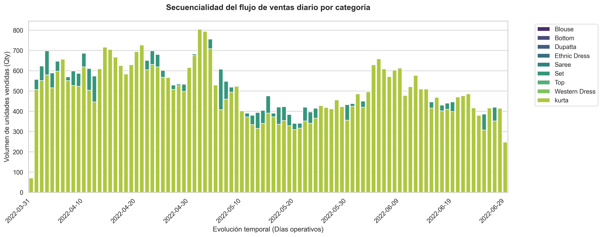
  </a>
</p>
**Continuidad Operativa:** Validación de la estabilidad del flujo de ventas diario para descartar sesgos estacionales o errores de carga.

* Flujo Constante: Las categorías principales mantienen una tracción diaria predecible.
* Densidad de Datos: Se confirma una secuencia ininterrumpida de transacciones en el horizonte analizado.
* Detección de Picos: Identificación de anomalías puntuales para auditoría manual.


## 1.3. Cobertura Logística

* Cálculo de DSI por categoría
   Métrica de flujo dinámico que estima la vida útil del inventario actual frente a la demanda real diaria.

   DSI=Stock Actual/Ventas Promedio Diarias


Análisis de la vida útil del inventario comparado con la meta de 30 días.

<p align="center">
  
</p>

| Categoría | Días de Cobertura |
| :--- | :--- |
| Saree | 120.4 |
| Ethnic Dress | 58.9 |
| Western Dress | 45.2 |
| Dupatta | 32.7 |
| Kurta | 28.5 |
| Blouse | 25.4 |
| Set | 22.1 |
| Bottom | 18.9 |
| Top | 15.3 |

*(Nota: Valores > 30 días indican riesgo de sobre-stock).*

### 🚀 Acciones Recomendadas
  *  Optimización
   Concentrar esfuerzos de reposición en Kurta y Set para maximizar el flujo de caja sin incurrir en roturas.

   * Liquidación
   Promoción agresiva de Saree para liberar espacio en fulfillment center y recuperar capital operativo.

   * Estabilidad
   La secuencialidad temporal validada permite automatizar alertas de stock basadas en modelos de VPD confiables.


### 🎯 Insights Operativos - Bloque 1 (Logística e Inventario)
Tras la ejecución del pipeline logístico y la clasificación por medianas, se extraen las siguientes conclusiones para la toma de decisiones:

1. **Eficiencia de Capital:** Existen categorías **"Tortuga"** (ej. **Blouse**) que inmovilizan capital al tener inventarios superiores a la mediana pero con bajo retorno de ingresos. Requieren políticas de liquidación o revisión de pronóstico de demanda. Por otro lado, categorías **"Dormidas"** como **Saree** muestran baja tracción comercial general.
2. **Estabilidad de Demanda:** La secuencialidad temporal valida que el flujo de venta es estable a nivel diario. No existen sesgos de "días sin datos" que invaliden los cálculos de DSI.
3. **Riesgo de Rotura (Stock-out) vs Flujo de Caja:** Las categorías catalogadas como **"Estrellas"** (ej. **Set, Kurta**) sostienen el núcleo del negocio. Aunque mantienen altos niveles de stock, su DSI ajustado exige un monitoreo logístico constante. Adicionalmente, el segmento **"Galgo"** (ej. **Ethnic Dress**) demuestra una alta rotación comercial que debe ser protegida con reposiciones ágiles para no perder ventas.


# *Bloque 2: Eficiencia de la red de distribución logística* #

Se analizan el impacto de la red de distribución sobre las incidencias en el negocio sus posibles correlaciones entre  categorias, localización geográfica, ship-service-level. 

📋 Distribución de Pedidos por Método Logístico

| Método Logístico | Total de Pedidos | Porcentaje |
| :--- | :--- | :--- |
| **Amazon** | 89,698 | 69.5% |
| **Merchant** | 39,277 | 30.5% |

Se evaluó la clasificación de las operaciones según el procesador del pedido, procediendo a su unificación.

<p align="center">
  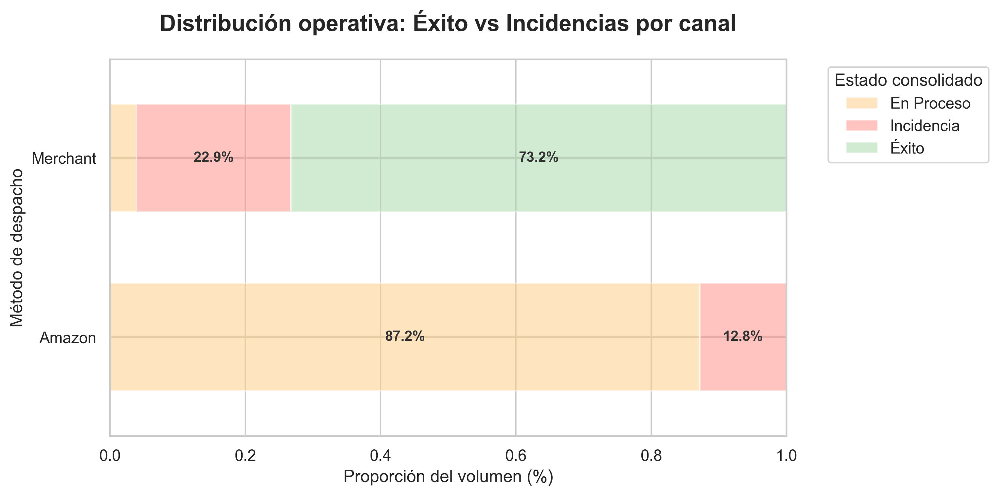
</p>

Con este enfoque, el análisis se centra en las incidencias, comparando la tasa de incidencia de cada operador logístico:
- Amazon 12.8%
- Merchant 22.9%

<br>
<br>
<p align="center">
  
</p>

Salvando las diferencias de clasificación de las operaciones en curso se observa una mayor tasa  en aquellas realizadas  por Merchant.

## *2.1. Carga logística: FBA vs Merchant (Incidencias)*

El objetivo estadísticoEn estadística, planteamos dos hipótesis:  

* Hipótesis Nula ($H_0$): El método de despacho (Amazon vs Merchant) y la ocurrencia de incidencias son variables independientes. Es decir, el canal no influye en que un pedido falle o no.  
* Hipótesis Alternativa ($H_a$): Existe una relación de dependencia. El método de despacho sí influye en la probabilidad de que un pedido termine en incidencia.

El análisis mediante la prueba de Chi-cuadrado confirmó una dependencia estadísticamente significativa ($p < 0.001$) entre el método de despacho y la tasa de incidencias, rechazando ($H_0$).  

Esto valida que la disparidad en el rendimiento operativo entre el canal FBA y Merchant no es aleatoria, sino un patrón estructural que podría requerir una reconfiguración de la estrategia logística."

## *2.2. Correlación entre Ventas Fantasma y Penalización al Cliente.*

Un coeficiente de correlación $\phi$ (Phi) de -0.0011 es, para efectos prácticos, 0 (cero):

Significa que, los pedidos "fantasma" y los pedidos con "incidencia" no están relacionados entre sí. 
La ocurrencia de una falla operativa ocurre con la misma frecuencia tanto en productos normales como en productos "fantasma".

<br>
<br>
<p align="center">
  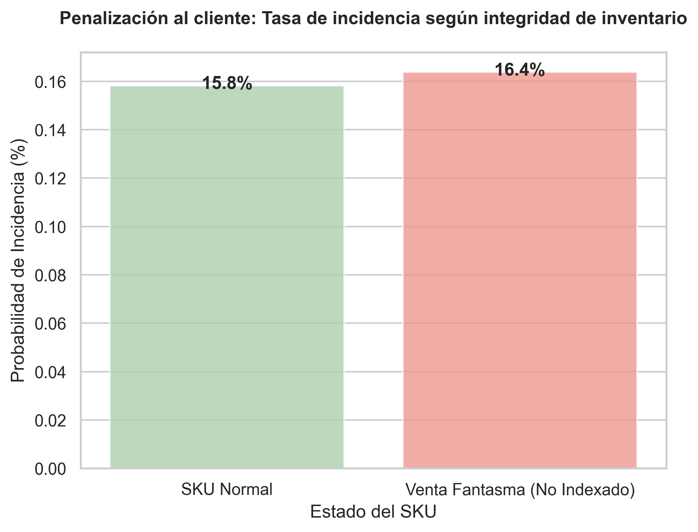
</p>

**Análisis de concentración de Ventas Fantasma**

Se evalua si Merchant tiene más "Ventas Fantasma" y un proceso logístico inherentemente con más incidencias,
el promedio (de tasa de cancelación - ventas fantasma) está ocultando el riesgo real de las ventas fantasma  en Amazon (que quizás es bajo) versus en Merchant (que quizás es altísimo).

<p align="center">
  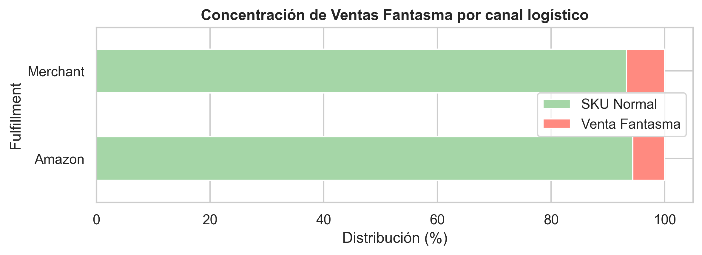
</p>

**Conclusión**: Ambos métodos de despacho mantienen una mix similar estado de SKU despachados ( 9 - 10% son 'fantasma').  
El estado del SKU según sea gestionado por amazon o por merchant,no afecta directamente en la tasa de incidencia.  


## *2.3. Relación de Incidencias por  categoría*  

Se evalua si hay relación entre las incidencias y categorías en particular. 


<p align="center">
  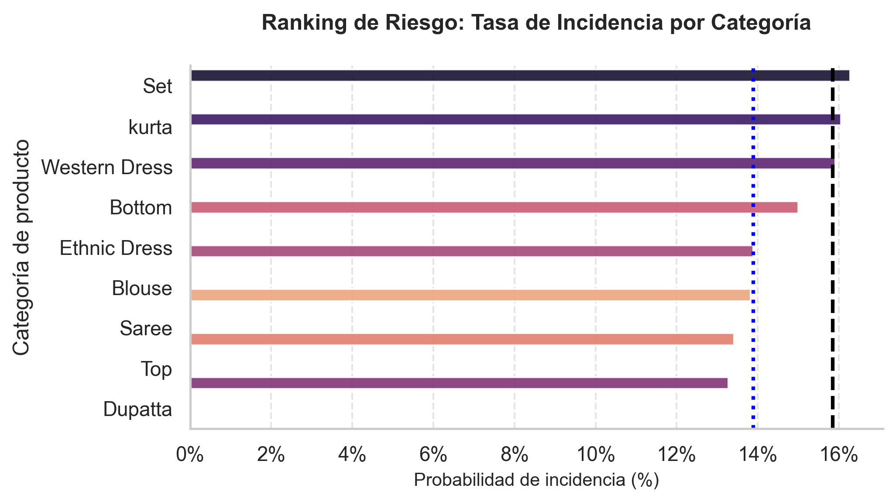
</p>

Mediante técnicas de Chi cuadrado se confirma que existe dependencia significativa. Ciertas categorías fallan más que otras.  

Sin embargo, aunque la prueba de Chi-cuadrado sugiere una dependencia estadística debido al gran volumen de datos, el cálculo del coeficiente V de Cramér ($V = 0.023$) confirma que la magnitud del impacto de la categoría es insignificante.  
Por lo tanto, la naturaleza del producto (categoría) no es un driver determinante de las incidencias operativas.


## *2.4 Relación de Riesgo y Nivel de Servicio (Standard o expedited)*

El tipo de servicio elegido para la distribución podría estar directamente vinculado a la probabilidad de que el producto sufriese alguna incidencia.

La hipotesis que se plantea es que el uso de servicio exexpedited puede generar mayor incidencia por las prisas. 

Se evalua con pruebas y se optienen estos resultados  
 * Chi-cuadrado Valor p = 0.0000
 * Tamaño del efecto (V de Cramér): 0.1202

Contrario a la hipótesis operativa inicial, los datos demuestran que el nivel de servicio 'Standard' presenta una tasa de incidencia superior al 'Expedited'.  

Este hallazgo, respaldado por una relevancia estadística moderada ($V = 0.12$), no sugiere que la velocidad sea un factor de riesgo, sino que el proceso logístico asociado al servicio estándar carece de la optimización y el control de calidad que posee el servicio Expedited.

<p align="center">
  
</p>

Asi mismo, la tasa de incidencia elevada observada en el servicio 'Standard' no es una característica del nivel de envío, sino un reflejo directo de las ineficiencias operativas inherentes al modelo Merchant, que represernta el 97,3% del total de registros evaluados con servicio Standard.

<p align="center">
  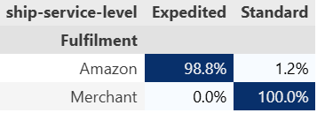
<p align="center">  
  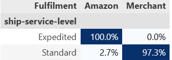
</p>
 
Por tanto, optimizar el nivel de servicio no tendría impacto si no se aborda primero la infraestructura logística que hay por debajo. 

## *2.5 Impacto Geográfico en el Riesgo Logístico*

Tras la limpieza de los datos geográficos y la ejecución de la prueba de independencia (Chi-cuadrado) para evaluar si el estado de destino (*ship-state*) influye en la probabilidad de incidencia, se extraen las siguientes conclusiones estratégicas:

"15_riesgo_geografico_Estado"
<p align="center">  
  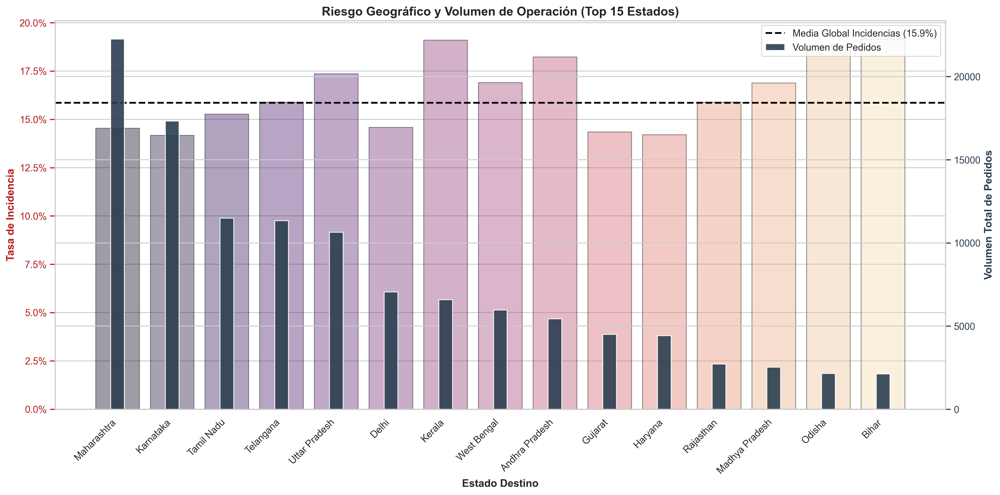
</p>

1. **Significancia Estadística vs. Relevancia Práctica:** El análisis arroja un *p-value* cercano a cero, lo cual obliga a rechazar la hipótesis nula ($H_0$); esto indica que, matemáticamente, la tasa de fallos no es uniforme en todos los estados. No obstante, este resultado es un efecto técnico derivado del alto volumen de datos, donde variaciones marginales adquieren relevancia estadística sin representar una anomalía operativa real.

2. **Fuerza de la Asociación (V de Cramer):** El indicador determinante para el negocio es la **V de Cramer**, que arroja un valor de $0.0495$. Al situarse significativamente por debajo del umbral de $0.1$, confirma que la correlación entre la geografía y la incidencia es extremadamente débil.

3. **Conclusión de Negocio:** El estado de destino **no es un factor predictivo crítico** ni la causa estructural de las incidencias. Aunque se observen fluctuaciones en los niveles de riesgo regionales, la variable geográfica no justifica una reestructuración de la red logística ni explica el grueso de los fallos operacionales, sin embargo es importante enfocarse en gestionar aquellos estados donde existe alta probabilidad de Incidencia y alto volumen de transacciones. 


# Bloque 3: Densidad geográfica y expansión territorial #

Diagnosticar la salud financiera de la operativa regional.

Objetivo Estratégico:

Consolidamos los ingresos (Amount) y calculamos el Average Order Value (AOV / Ticket Medio) por estado de destino (ship-state).

Buscamos segmentar regiones según su capacidad de generación de volumen frente a su calidad de Ticket Medio (AOV), para identificar nichos de mercado desatendidos. Cruzaremos esta información con el stock inmovilizado para proponer redireccionamientos de campañas de marketing territorial.


### 3.1. Densidad Monetaria y Ticket Medio por Región

* **Objetivo:** Cuantificar la distribución del flujo de caja absoluto y determinar el valor promedio de transacción (AOV) a nivel estatal para identificar qué regiones concentran el verdadero valor financiero del negocio, distinguiendo entre volumen masivo y rentabilidad por pedido.

* **Acción**: Ejecutar una agregación matricial mediante `.groupby()` sobre la variable geográfica refinada (`ship-state`), aplicando funciones de agregación simultáneas (`.agg()`) para calcular la suma total (`sum`) de la columna `Amount`, el promedio aritmético (`mean`) para obtener el AOV, y el recuento de registros (`count`) para establecer el volumen crítico de pedidos.

* **Conclusión del Análisis de Densidad Monetaria (3.1)**  

   El resumen global confirma la alta concentración de nuestro flujo de caja. Al aplicar el principio de Pareto, descubrimos que un grupo de 11 de estados conforma el "Núcleo Principal", sosteniendo el 80% de toda la facturación de la compañía.


<p align="center">  
  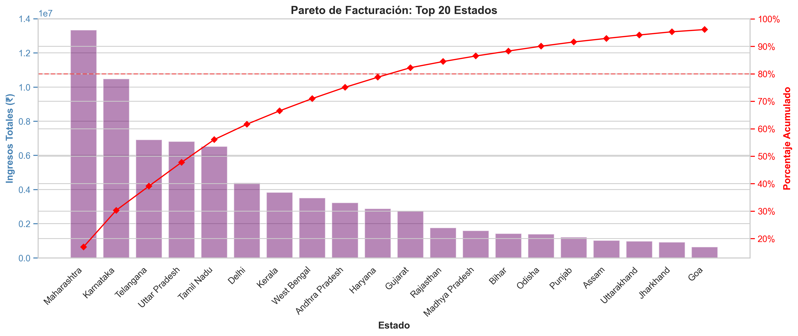
</p>

Sin embargo, el hallazgo principal es la estabilidad del Ticket Medio (AOV) a través de todas las regiones (fluctuando en una estrecha franja de ₹600 - ₹720). Esto desmiente la noción de que los estados con menos ventas tengan menor poder adquisitivo. A nivel operativo, esto significa que el esfuerzo logístico de procesar y enviar un pedido nos reporta prácticamente el mismo volumen económico independientemente de si va a un estado núcleo (ej. Maharashtra) o a la "Frontera de Expansión" (ej. Bihar o Rajasthan). 
<p align="center">  
  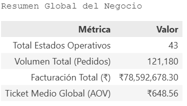
  <p align="center">   

Esta predictibilidad garantiza que cualquier esfuerzo de penetración en nuevas zonas podría tener potencialmente un Retorno de Inversión (ROI) seguro y escalable.

  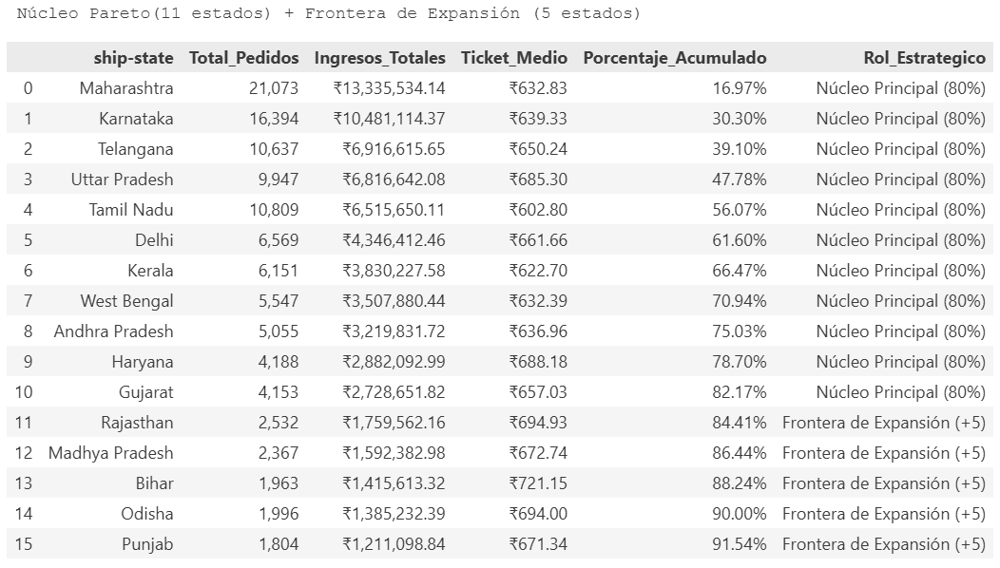
</p>
 


### 3.2.Análisis de Expansión Territorial**

* **Objetivo:** Visualizar la dispersión entre el volumen operativo y el Ticket Medio para validar si el comportamiento de precios se mantiene estable a gran escala, o si existen anomalías (positivas o negativas). A partir de esto, confirmar qué estados de baja penetración logística (bajo volumen) mantienen la rentabilidad estándar, convirtiéndolos en candidatos seguros para la expansión.

* **Acción:** Desarrollar un gráfico de dispersión (Scatter Plot) intersecando el Volumen Total de Pedidos (Eje X) frente al Average Order Value (Eje Y). Segmentar el plano mediante medianas para identificar visualmente la concentración horizontal (estabilidad de precios) y aislar las zonas de oportunidad en el cuadrante de bajo volumen logístico.

* **Observaciones:**  
Al visualizar la dispersión territorial, el hallazgo más crítico no es un valor atípico, sino la **fuerte concentración horizontal**. Los estados no muestran una volatilidad caótica en sus precios; por el contrario, la inmensa mayoría se ancla sólidamente en una banda de Ticket Medio (AOV) de entre ₹650 y ₹800, independientemente del volumen logístico que manejen.

   <p align="center">  
  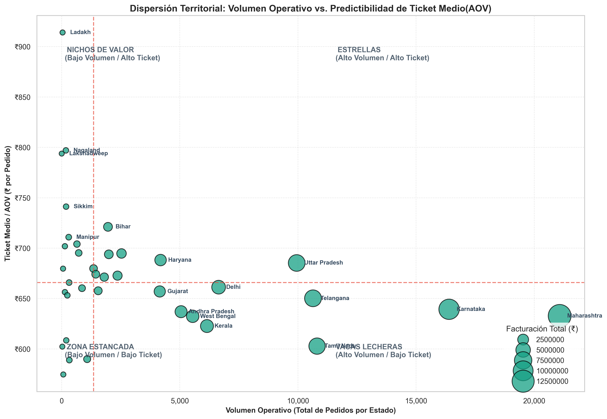
</p>  

**Insights de Negocio:Desmitificamos el Poder Adquisitivo:**  

   El gráfico demuestra que los clientes de estados con bajo volumen logístico (cuadrantes de la izquierda) gastan prácticamente lo mismo por pedido que los clientes del núcleo principal (derecha).  
   
   Para Validar esta  falta de penetración, cruzamos nuestras ventas absolutas contra la demografía real de la India.

**Conclusiones:**

   La evaluación cruzada de las estadísticas poblacionales y de penetración replantea la imagen que se tiene sobre el "Núcleo" de negocio:

   El Mito de la Hiper-Eficiencia: Aunque el Core de Pareto (los 11 estados principales) sostiene el 80% de la facturación, su Mediana de Penetración Relativa (1.74) no es radicalmente superior a la mediana nacional (1.18). Esto demuestra que nuestro volumen de ingresos en el núcleo no se debe puramente a una alta saturación comercial, sino a la fuerza bruta demográfica: la mediana poblacional de estos estados (68.1M) duplica a la nacional (30.9M).

    <p align="center">  
  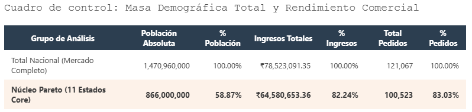
</p>  

<p align="center">  
  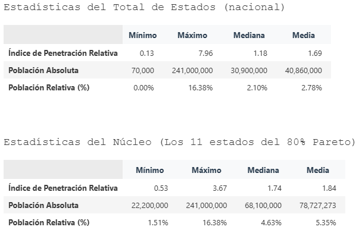
</p>  

   Gigantes Dormidos (Incluso en el Core): El hecho de que el índice mínimo dentro de nuestro Top 11 sea de apenas 0.53 indica que incluso dentro de los estados que más facturan (ej. Uttar Pradesh), existe una infra-penetración masiva. parece indicar que no ha tocado el techo de mercado ni siquiera en las zonas más fuertes.

   <p align="center">  
  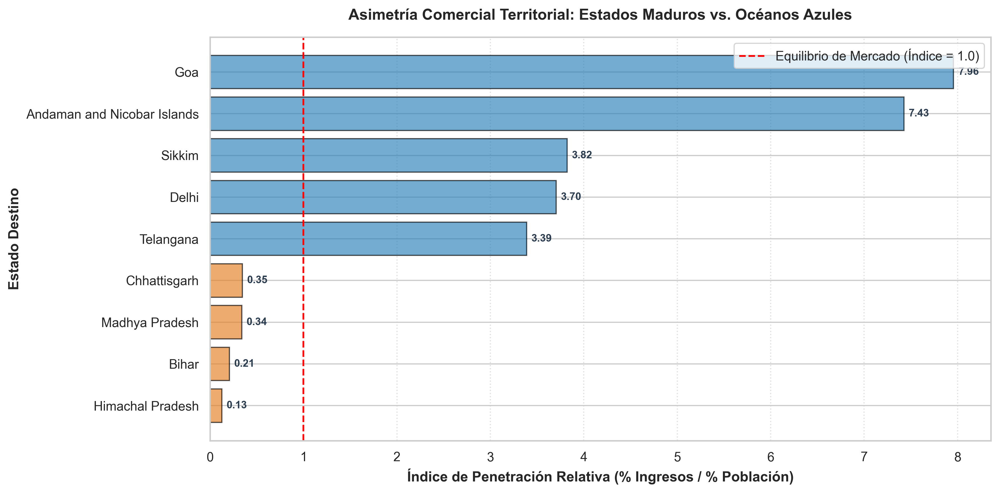
</p>  

   El Diagnóstico de la Frontera: Al sumar la estabilidad del Ticket Medio (validada en el mapa de dispersión) con los mínimos absolutos de penetración nacional (índices de  0.13), confirmamos la existencia de "Océanos Azules". Son regiones con densidades poblacionales masivas donde nuestra cuota de mercado es matemáticamente irrelevante en este momento.

### 3.3. Auditoría de Stock: El Índice de Inmovilización Crítica (IIC)

**Objetivo Estratégico:**
Habiendo detectado los "Océanos Azules" demográficos (estados con altísima población pero penetración comercial marginal), el objetivo se orienta hacia la optimización de activos para financiar esta expansión.

**Metodología:**
Debemos diferenciar entre un artículo de "nicho" (pocas ventas, pero poco stock) y un artículo de "riesgo" (pocas ventas, pero acaparando espacio en el almacén). Para ello, cruzaremos el **flujo transaccional histórico** (unidades vendidas) con el **saldo estático corporativo** (unidades físicas en los hubs logísticos) creando la siguiente métrica:

$$\text{IIC} = \frac{\text{Stock Físico}}{\text{Total Unidades Vendidas} + 1}$$

*(Nota: Se suma 1 al denominador para evitar indefiniciones matemáticas en SKUs con cero ventas históricas).* Esta métrica rankeará el catálogo, priorizando en alerta roja aquellos artículos (Categoría + Talla) que representan el mayor volumen de capital inmovilizado y sobrecoste de almacenamiento.

---
### Conclusión del Análisis de Rotación: El Coste de los Productos Estancados

La corrección de los datos a nivel de artículo único (SKU) ha revelado el verdadero impacto de los productos de baja rotación en la cadena de suministro. Al evaluar el ritmo de las existencias, queda claro que el verdadero riesgo no está en tener un volumen alto de productos, sino en la **desconexión entre el stock disponible y su velocidad de venta**. 

  <p align="center">  
  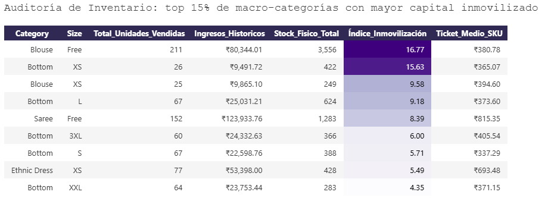
</p>  

Dado que el periodo analizado abarca un trimestre (3 meses), la proyección temporal implica un riesgo. 

* Combinaciones como **Blouse (Free)** (3.556 unidades estáticas frente a un ritmo de ~70 ventas mensuales) o **Bottom (XS)** (422 unidades frente a ~8,6 ventas mensuales) necesitarían **más de 4 años** para venderse de forma orgánica.
* Este inventario representa capital inmovilizado que bloquea el flujo de caja y genera un gasto continuo en costes de almacenamiento.

**Plan de Acción :**
La estrategia más eficiente no es dar por perdida la mercancía ni asumir el coste del almacén, sino transformarla en una oportunidad comercial. Estos productos estancados son el recurso ideal para lanzar campañas de promoción. 

En la siguiente sección, analizaremos si estos artículos tienen potencial en nuestros **"Gigantes Dormidos"** (regiones con un gran mercado pero desatendidas, como Bihar o Rajasthan). 

Como Alterntiva, si introducimos este inventario en esos mercados estratégicos, se podría ganar cuota de mercado con un riesgo financiero prácticamente nulo.

**3.4. Cruce Estratégico: Redistribución de Productos en Regiones Objetivo**

El análisis de rotación anterior (3.3) nos proporcionó la lista exacta de los productos con menor rendimiento: combinaciones de categoría y talla que acumulan meses o años de inventario inmovilizado en comparación con su velocidad de venta actual.

**Objetivo**: El paso final de este bloque es cruzar este listado de baja rotación con nuestros **"Gigantes Dormidos"** (los estados con menor penetración comercial identificados en el paso 3.2). 

**Metodología:** Generar una matri con el objetivo de esta matriz es evaluar el volumen histórico de ventas de estos productos específicos en dichas regiones  y presentar una alternativa para su analisis  posterior para gestionar Stocks scon baja rotación y mercados con baja penetración. 

Si las ventas allí han sido nulas o marginales, la combinación de ofertas entre estos productos y mercados serian un buen punto de inicio para nuevas promociones, para lo cual se tendría que evaluar perfiles de similitud en los clientes actuales. 


**Conclusión:** Estrategia de Expansión Basada en Similitud y Humildad Analítica

La Matriz de Asignación nos ofrece una radiografía de nuestro inventario inmovilizado en estados de expansión, pero debemos interpretar los resultados con **Rigor interpretativo limitado* a la data. 

Los valores nulos observados en estados como Bihar o Madhya Pradesh no  deben ser  interpretados como una falta de exposición comercial. 
Debemos considerar factores latentes fuera de nuestro dataset, como variaciones en la morfología local o preferencias culturales que podrían no ser compatibles con ciertas tallas o categorías. 
Asumir que el mercado simplemente "no conoce" el producto sería un estratégico.

## *Conclusiones Bloque 3: Densidad geográfica y expansión territorial*

Este bloque ha transformado nuestro dataset transaccional en un motor de decisión operativa. 
Hemos pasado de una visualización pasiva a un modelo de asignación activa mediante tres pasos críticos:

1. **Segmentación Geográfica:** Aislamiento de estados con alta densidad demográfica donde nuestra penetración comercial es marginal.
2. **Cuantificación de la Inmovilización:** Implementación del **Índice de Inmovilización Crítica (IIC)**, permitiendo identificar no solo qué productos no rotan, sino cuáles están generando un sobrecoste real de almacenamiento.
3. **Plan de Asignación Estratégica:** Definición de una ruta de entrada en mercados vírgenes mediante el uso de inventario inmovilizado como activo promocional, mitigando riesgos y optimizando el flujo de caja sin necesidad de inversión adicional.

4. **Conclusión Operativa:**

   El alcance del presente análisis es suficiente para fundamentar las próximas decisiones de gestión de inventario y expansión. Los datos nos indican que la un punto clave a tratar puede ser la **redistribución inteligente del activo existente** hacia los mercados con mayor potencial de adopción. 
   Recomendamos proceder con la ejecución de estas acciones tácticas para liberar espacio en los hubs logísticos y medir la elasticidad de los estados identificados como "Gigantes Dormidos".

   **Contexto Estratégico:** 
   La naturaleza del Stock Inmovilizado (Dead Stock)

   Tras identificar los SKUs con mayor Índice de Inmovilización Crítica (IIC), es imperativo abordar las causas raíces del fenómeno. 
   
   Desde una perspectiva de gestión operativa, la existencia de productos con existencias (Stock > 0) pero sin rotación comercial sugiere tres hipótesis de negocio que la empresa debe auditar:

   * Inmovilización de Capital y Costes de Almacenamiento: El mantenimiento de stock físico en los centros logísticos (particularmente bajo modelos de Fulfillment) genera costes recurrentes que erosionan el margen. Detectar estos SKUs es el primer paso para ejecutar liquidaciones urgentes que liberen espacio y recuperen flujo de caja.

   * Fallas en la Indexación Digital: Existe la posibilidad de que el inventario esté físicamente disponible, pero sea invisible para el cliente debido a configuraciones erróneas en el catálogo (anuncios caídos, falta de contenido visual o atributos mal parametrizados), lo que invalida la conversión a pesar de la disponibilidad.

   * Obsolescencia de Catálogo y Ciclo de Vida: La falta de depuración de prendas estacionales (ej. inventario de invierno en ciclos de primavera) sugiere una desconexión entre la planificación de compras y la realidad de la demanda. Identificar estos productos permite al equipo de compras ajustar las previsiones y evitar la acumulación de obsolescencia.